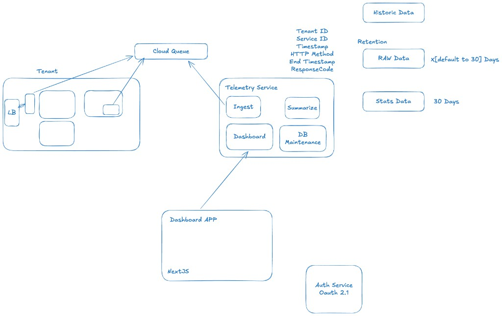
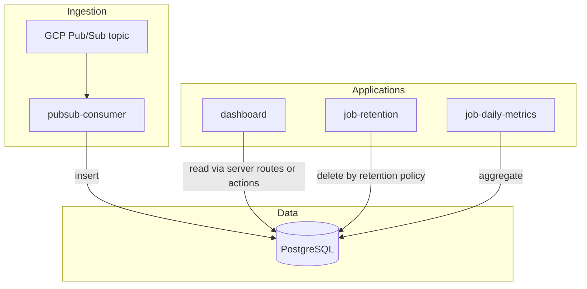

# Architecture

This repository is a **pnpm workspace** monorepo orchestrated by **Turborepo**. All packages use **TypeScript**, **ESM** (`"type": "module"`), and target **Node 20+**. The persistence layer uses **PostgreSQL** with the **`pg`** driver and **SQL migrations** (no ORM).

## System overview (reference diagram)

High-level target architecture: tenants send telemetry through a cloud queue into a telemetry surface (ingest, summarize, dashboard API, DB maintenance), with retention tiers for raw vs summarized vs historic data and OAuth 2.1 for auth. The diagram below is the source-of-truth sketch for that shape; concrete apps and packages are mapped in [Workspace map](#workspace-map).

## Workspace map

| Path | Name | Role |
|------|------|------|
| `apps/dashboard` | `dashboard` | Next.js (App Router) UI: reads `service_daily_dashboard_stats` and raw `http_request_records` for drill-down; transpiles `@repo/types` and `@repo/db`. |
| `apps/pubsub-consumer` | `pubsub-consumer` | Subscribes to a GCP Pub/Sub subscription and inserts rows into `http_request_records`. |
| `apps/job-retention` | `job-retention` | HTTP service: `POST /run` applies retention (deletes old rows). Intended for **Cloud Scheduler** (or cron) triggers. |
| `apps/job-daily-metrics` | `job-daily-metrics` | HTTP service: `POST /run` upserts **`service_daily_dashboard_stats`** from `http_request_records` for the last `METRICS_LOOKBACK_DAYS` UTC days. Intended for scheduled runs. |
| `packages/types` | `@repo/types` | Shared types split across modules; **persistence interfaces** (`HttpIngestPersistence`, `RetentionPersistence`, etc.) for services. |
| `packages/db` | `@repo/db` | `pg` pool, migrations, SQL queries, and **`createPg*Persistence`** adapters implementing those interfaces. |

## Data model

- **`http_request_records`** — Raw request rows (ingest). Columns: tenant, service, start/end, HTTP method, response code. See [`packages/db/migrations`](../packages/db/migrations).
- **`service_daily_dashboard_stats`** — One row per **tenant**, **service**, and **UTC calendar day** with counts: total requests, success (2xx), unauthorized (401), other 4xx, 5xx. Populated by the daily metrics job from raw data. The dashboard shows **average requests per second** for the day as `request_count / 86400`, plus **rates** (each count ÷ `request_count`). Drill-down uses raw rows and **hourly** buckets (epoch-aligned UTC hours) for the same day.

## Request and data flows

- **Dashboard**: Reads (and optionally writes) through `@repo/db` in server-only code paths; avoid importing `@repo/db` in client components.
- **Pub/Sub consumer**: Expects JSON payloads with fields compatible with `NewHttpRequestRecord` (camelCase or snake_case aliases supported in code).
- **Jobs**: Expose `GET /health` and `POST /run`. Optional shared **`JOB_SECRET`** checked via header `x-job-secret` for non-OIDC setups.

## GCP deployment (typical)

| Component | Common pattern |
|-----------|----------------|
| `pubsub-consumer` | **Cloud Run** with a **pull** subscription (keep min instances ≥ 1 if always listening) or **push** subscription to an HTTP handler. |
| `job-retention`, `job-daily-metrics` | **Cloud Run** services; **Cloud Scheduler** sends HTTP **POST** to `/run` (OIDC from scheduler to Cloud Run, or `JOB_SECRET`). |
| `dashboard` | **Cloud Run** or **Vercel**; set `DATABASE_URL` for server-side DB access. |
| Secrets | **Secret Manager** for `DATABASE_URL`, `JOB_SECRET`, and any API keys; inject as env vars at deploy time. |

## Commands (from repo root)

| Command | Purpose |
|---------|---------|
| `pnpm install` | Install all workspace dependencies. |
| `pnpm build` | Turborepo build of all packages. |
| `pnpm dev` | Turborepo dev (all configured dev tasks). |
| `pnpm db:migrate` | Run SQL migrations (`DATABASE_URL` required). |

## Environment variables (summary)

For local runs, copy [`.env.example`](../.env.example) to `.env` at the **repository root**. The dashboard (`next.config`) and `@repo/db` load that file into `process.env` (no extra flags needed).

| Variable | Used by |
|----------|---------|
| `DATABASE_URL` | `@repo/db`, all apps that touch Postgres |
| `PUBSUB_SUBSCRIPTION` | `pubsub-consumer` (full subscription resource name) |
| `JOB_SECRET` | `job-retention`, `job-daily-metrics` (optional) |
| `RETENTION_DAYS` | `job-retention` (default: 90) |
| `METRICS_LOOKBACK_DAYS` | `job-daily-metrics` (default: 7) |
| `DASHBOARD_TENANT_ID` | Optional filter on the Next.js home dashboard |
| `PORT` | Job HTTP servers (defaults: 8080 / 8081) |

GCP credentials for Pub/Sub use **Application Default Credentials** (e.g. workload identity on Cloud Run).

## Application services

Runnable apps keep **thin entrypoints** (`index.ts` / Next.js pages). Business logic lives in **`src/services/`** classes that depend on persistence **interfaces** from `@repo/types`; PostgreSQL implementations are **`createPg*Persistence(pool)`** in `@repo/db`. Unit tests (Vitest) mock the persistence interfaces so services stay free of real DB I/O.
